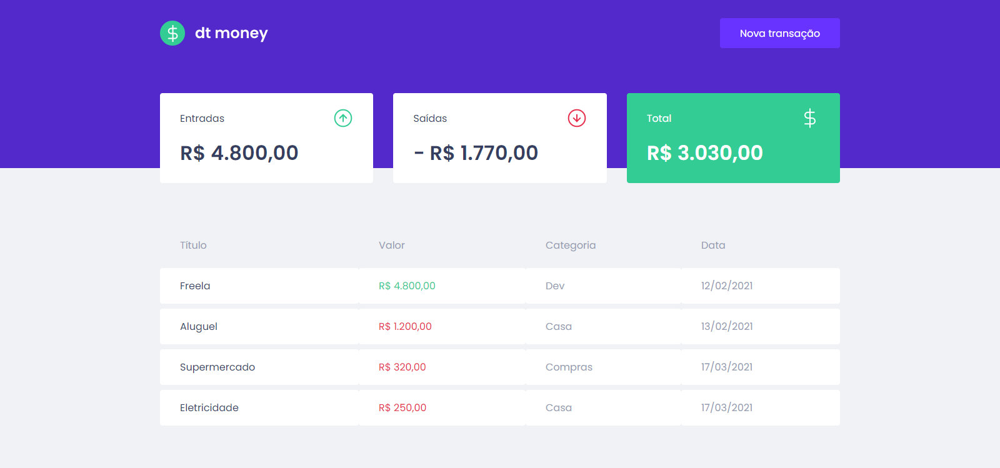
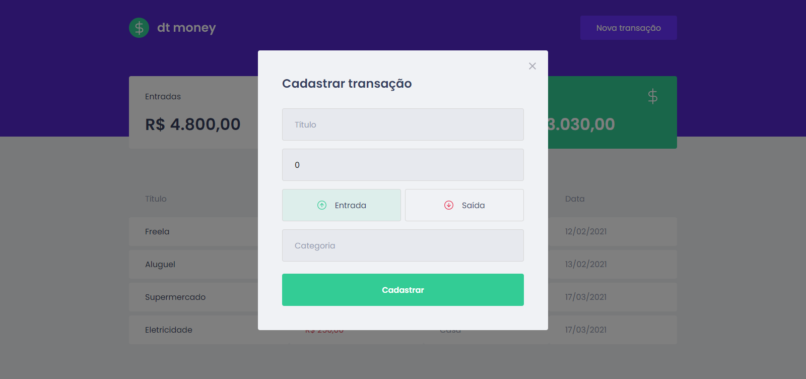

# Screenshots :camera:
<div align="center">
  
  
</div>

# Technologies :rocket:
This project was made using the follow technologies:
* [Typescript](https://www.typescriptlang.org/)      
* [ReactJS](https://reactjs.org/)    
* [Miragejs](https://miragejs.com/)

# Get it running :electric_plug:
```bash
# Clone Repository
$ git clone https://github.com/evandromarinh0/dtmoney.git
```

```bash
# Install Dependencies
$ yarn 
# Run Aplication
$ yarn dev
```
# License :page_facing_up:
This project is under the [MIT license](./LICENSE).